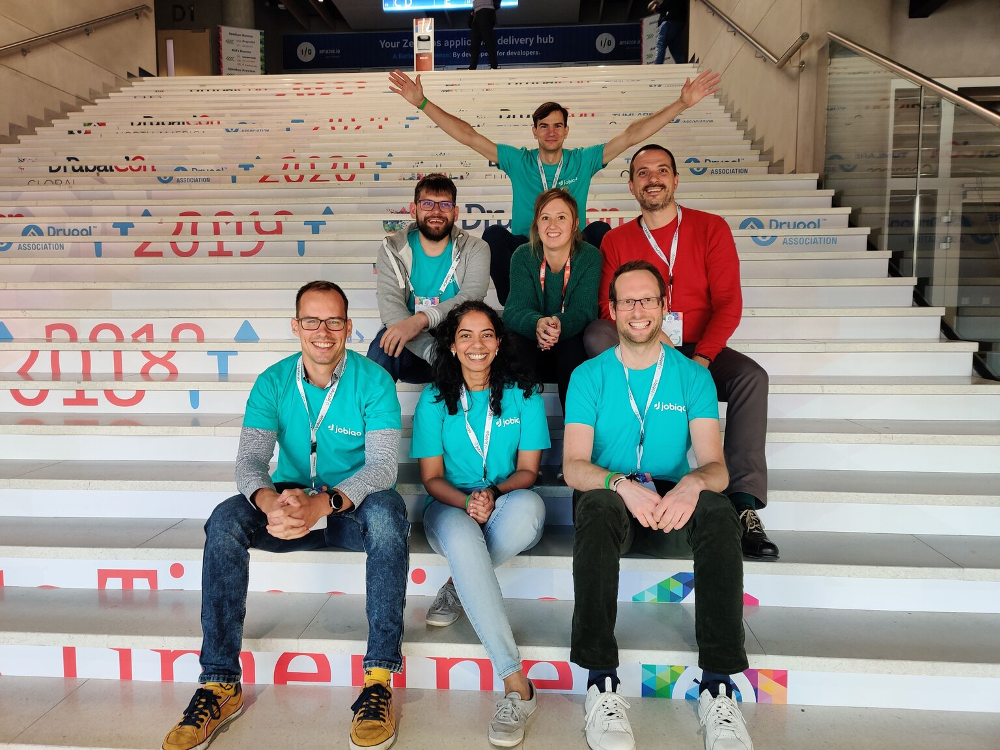
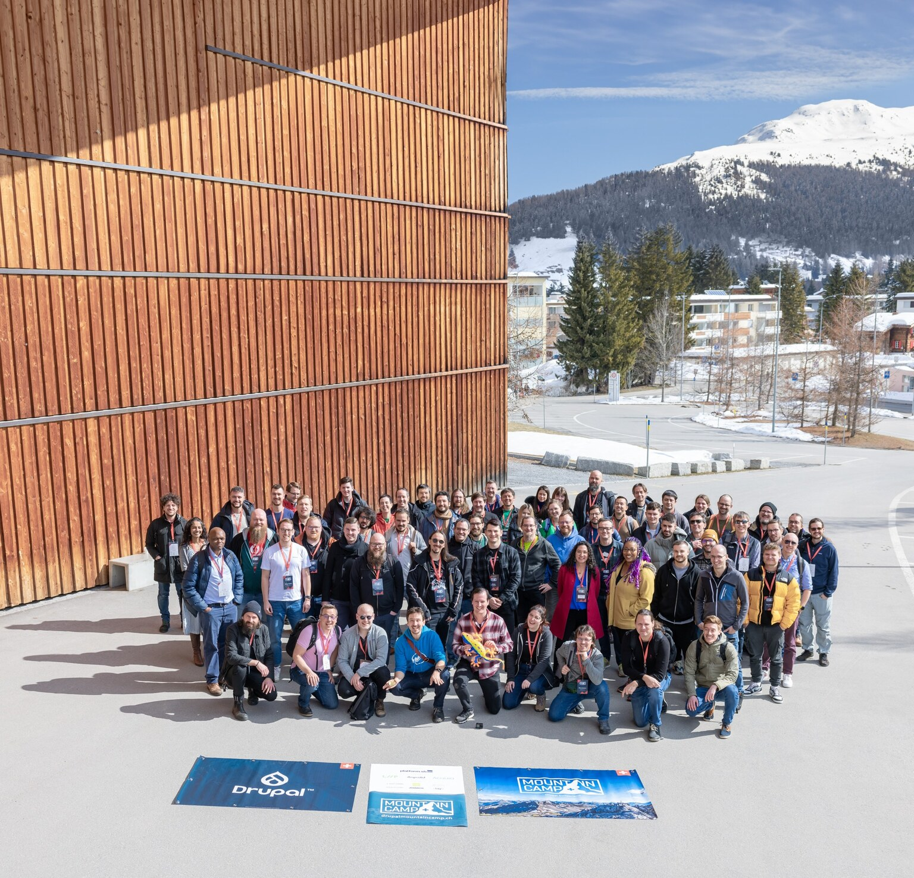
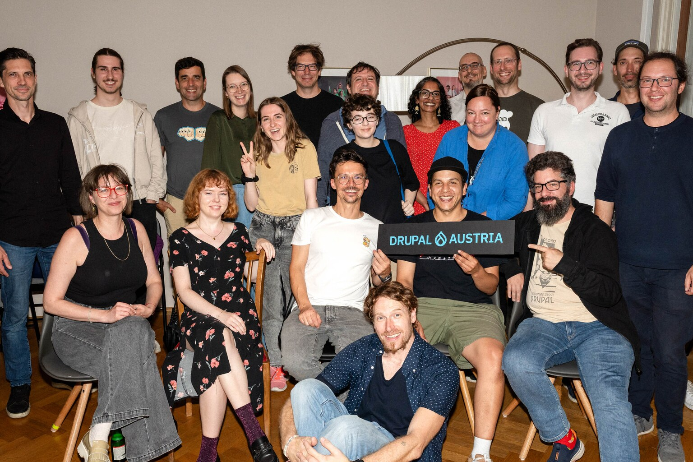
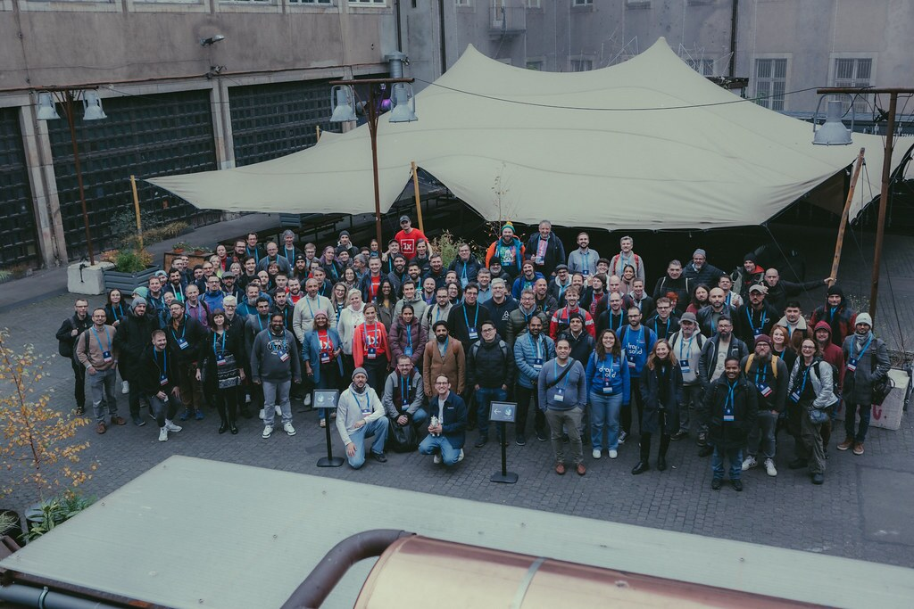

In January 2021, Klaus Purer brought me into the Drupal community. There is a Sinduri before Klausi and Drupal, and a Sinduri after. This is how one became the other.

<figure class="post-figure">
  <video controls preload="none" width="960" height="720" poster="/videos/journey-poster.webp" aria-describedby="journey-video-description">
    <source src="/videos/journey.webm" type="video/webm; codecs=av01.0.04M.08,opus">
    <source src="/videos/journey.mp4" type="video/mp4">
    <track kind="captions" src="/videos/journey.en.vtt" srclang="en" label="English" default>
    <a href="/videos/journey.mp4">Download the video of my Drupal journey (MP4, 5.4 MB)</a>
  </video>
  <figcaption id="journey-video-description">A 40-second slideshow of my Drupal journey: DrupalCon Vienna, the Women in Drupal Award, the Splash Awards, Drupal Mountain Camp, the Jobiqo, Drupal Austria and drunomics teams. No speech. Music by Journey.</figcaption>
</figure>

## Before Drupal

I studied civil engineering in India, then moved to the US to study environmental engineering. In 2017 I moved to Vienna, and that is when my tech journey began.

I always wanted to become a developer, but I never felt ready to make the switch until I moved to Vienna. Honestly, after doing a few German courses, learning to code seemed much easier! In 2019 I took a short Python course just to see if I was actually good at programming, and I loved it. That gave me the confidence to do a full-stack web development course focused on PHP.

## The Drupal test

Klaus Purer, a Drupal veteran who is now my mentor, found me on LinkedIn and interviewed me for a configuration manager role at Jobiqo. The role involved setting up third-party APIs and working as a backend developer. He gave me a test in Drupal. I had absolutely no idea what Drupal was at the time, but I did well enough to get the job.

I worked there for two and a half years, as a configuration manager and then as a developer, and by the end Drupal and its community were a big part of my life.

If you have never heard of it either: Drupal is a free, open source content management system that lets you build anything from a simple blog to complex enterprise websites. The European Commission, the United Nations, Kurier and a lot of universities and governments trust it because it is secure, scalable, and handles complex requirements well. What makes Drupal special is its community, who keep improving the platform.

## From developer to product manager

When layoffs hit my company, I faced a choice: continue as a developer outside of open source, or try something new. drunomics offered me a product manager role, and I was immediately drawn to their commitment to the Drupal community and to open source contributions.

At drunomics I worked on mossbo, our cloud CMS, and the projects that tie into it: product development cycles, QA, client requirements and documentation. My developer background helped every single day. It helped me create realistic timelines, improve communication between stakeholders and engineering, and understand what developers actually need to be successful. I am so proud that our baby mossbo collected multiple awards in 2025!

## Saying yes to the community

In 2023 Klausi asked me to volunteer at Drupal Dev Days Vienna. I enjoyed working with the community so much that I started saying yes to every organising committee that asked for help. Soon I was helping organise Drupal Mountain Camp, Drupal Dev Days and DrupalCamp Berlin, all in the same year.

The Swiss community adopted me and taught me so much about events. The Austrian community welcomed me so warmly that it feels like home. I was elected to the Drupal Austria board as marketing manager, and in 2026 I am deputy marketing manager. My work continues through my commitment to Drupal Switzerland and Drupal Austria.

Why do I keep showing up? It comes down to two things: my passion for open source and the incredible strength of this community. Drupal would not exist without people contributing code, ideas and energy, and community events create the perfect space for that collaboration to happen.

I was reminded of this at a workshop organised by Mikko Hämäläinen, CEO of Druid, at Drupal Mountain Camp, where we discussed everyone's motivations for contributing. Despite our different backgrounds and journeys, we all shared the same core goal: contribute to something meaningful while growing personally in the process. That is what makes these events special. They are not just about networking. They are about channelling our collective passion for Drupal into something bigger and better.

## The Women in Drupal Award

At DrupalCon Vienna in 2025, I won the Women in Drupal Award in the Build category. It was overwhelming.

The Build category is for builders and makers. Developers, architects, or even HR specialists recruiting talent to build an innovative Drupal agency can be nominated, and so can community members who help build a thriving Drupal community.

This recognition truly belongs to the incredible community that has been with me every step of my Drupal adventure. This is what I wrote after the award, and every word still stands.

Thank you JAKALA and Kitt Ralkov for creating this beautiful initiative that celebrates women in Drupal. To the jury members and previous winners Esmeralda Tijhoff, Pamela Barone, and Alla Petrovska 🇺🇦, thank you for considering me for this award. Being recognized alongside the brilliant Jess (xjm) and Emma Horrell feels so humbling.

Baddy Sonja Breidert, your kind words touched me deeply. Everything you do for the Drupal community inspires us all.

Klaus Purer, my mentor and dearest friend, where do I even begin? You brought me into Drupal when I knew absolutely nothing and championed every step forward. Your unwavering support has been fundamental to everything I have achieved.

The drunomics team, Wolfgang Ziegler, Oliver Berndt, and Jeremy Chinquist, thank you for helping me grow professionally while always supporting my volunteer work.

My incredible cheerleaders and support system: Arthur Lorenz, Petar Basic, Alexandru Ieremia, Liopold D. Novelli, Petra Morawa-Zechner, thank you for your constant encouragement, which pushed me to grow in ways I never imagined possible.

The Swiss community, especially Daniel Lemon, Josef Kruckenberg, Guzman Bellon, and Jens Vranckx, thank you for adopting me and teaching me so much about events and the community.

The Austria community, especially Nico Grienauer, Christian Ziegler, Alenka Vozelj, Baris Tosun, Oliver Köhler, David Fröhlich, Thomas, Rosie, Lucas Renner, .lowfidelity and many more, thank you for welcoming me so warmly and making me feel at home in the community.

Special thanks to Miro Michalicka, Niklas Franke, Gábor Hojtsy, Norman Kämper-Leymann, Yannick Leyendecker, Joris Vercammen, Mikko Hämäläinen, Hilmar Kári Hallbjörnsson, Ben Peter Mathew, Günter Dressel, Johanna Mayr-Keber, Kostis Kourakis, Michael Lenahan, Rouven Volk and so many more wonderful people for your endless support and kindness!

Last but not least, to the non-Drupaler, my husband Johann Fladeboe, thank you for blindly supporting me through all those self-funded trips, for being patient while I was glued to my computer almost every weekend and evening, and for taking care of me through it all. Thank you for always having my back.

## There is room for everyone

Open source communities like Drupal are models for effective collaboration. Drupal has created a global network where people contribute based on passion and expertise, not hierarchies. The skills you develop while contributing (communication, collaboration, problem-solving and mentorship) transfer to every aspect of life.

I want more people to discover Drupal and other open source communities. There is room for everyone: developers, designers, writers, marketers and managers. My goal is to connect people across different sectors, bring together newcomers and experienced contributors, and spread positivity. That is how we make sure open source communities like Drupal continue to evolve.

The Drupal community will forever hold my heart. You are the most amazing people!

---

Photo credits: [Daniel Lemon](https://danlemon.com/), [Paul Johnson](https://www.drupal.org/u/pdjohnson), [Joris Vercammen](https://www.drupal.org/u/borisson_), [Baris Tosun](https://www.drupal.org/u/rominronin), [Klaus Purer](https://klau.si/), [Alex Gruber](https://www.linkedin.com/in/alex-gruber-59617549/) and more. Music in the video by Journey.
