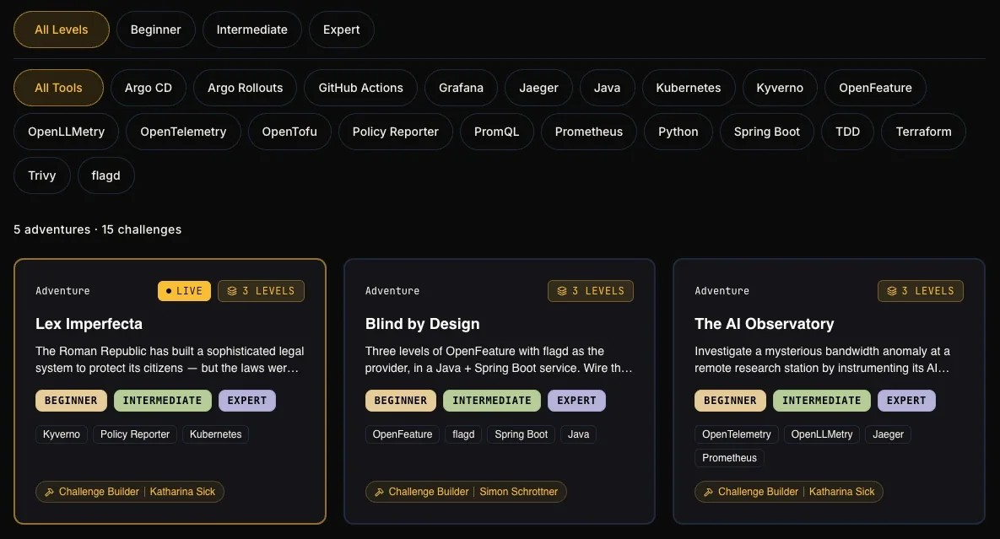

# Open Source Is Not Just Code

Designing Communities That Actually Scale

Sinduri Guntupalli

---

```yaml
part: Introduction
```

# About Me


Sinduri Guntupalli, Sr Developer Programs Engineer, OSPO team at Dynatrace

- 5.5 years in Drupal: developer, then Product Manager
- Volunteer organizer across Drupal Austria, Drupal Switzerland, and beyond
- Open Source Program Office team at Dynatrace
- Building [OffOn.dev](https://offon.dev/), a vendor-neutral community to sustain open source contributors and grow the maintainers of tomorrow

---

# Open Source Runs Everything

- **Linux**: most servers, the cloud, and every Android phone.
- **Git**: version control behind nearly all software.
- **curl**: moves data inside cars, TVs, phones, and servers.
- **OpenSSL**: secures a huge share of web traffic.
- **Python**: powers data work and most of modern AI.
- **Kubernetes**: runs cloud infrastructure at scale.

Most of the open source projects are maintained by small teams, often unpaid volunteers.

---

```yaml
layout: section
part: 'Part 1: The Burden'
```

# The Burden

Most projects don't fail on code. They fail under invisible weight.

---

# The Comfortable Myth

- The myth: success comes from code quality
- Just ship better code, and the rest follows
- Mostly wrong

---

# What Actually Kills Projects

- Unclear contribution paths
- Expectations never written down
- A few absorb all the pressure
- Fragile, then it stalls

---

# A Socio-Technical System

- A socio-technical system
- Code and community are one system
- Community design matters as much as code

---

# The Maintainer Trap

- Work piles onto a few people
- The hero maintainer burns out
- A single point of failure is a design flaw

**A Good Model: [Rust](https://www.rust-lang.org/governance)**

Topic-focused teams (compiler, language, libraries, tooling, infrastructure) each own their area independently. A leadership council coordinates across teams. Ownership is spread by design, so no single person carries the whole project.

---

```yaml
layout: section
part: 'Part 2: The Fellowship'
```

# The Fellowship

The work is too much for one person. It has to be shared.

---

# Six Pillars That Decide Whether a Project Lasts

- **Governance**: who decides, and how. Make decision-making explicit before you need it.
- **Contributor Experience**: how easy and rewarding it is to help. Lower the cost of showing up.
- **Recognition**: whether people's work is seen and valued. Most community labor is invisible.
- **Local Community**: where belonging actually forms. Global projects still need local homes.
- **Communication**: whether people can explain what it solves, and why. This is how a project gets known.
- **Funding and Sponsorship**: whether the work is paid for. Time is never really free.

---

```yaml
label: 'Pillar 1'
```

# Governance

- Decide how you will decide, early
- Put shared functions under a neutral body
- Spread maintainer roles across people
- Give conflict a clear path
- Pick a model: BDFL, council, or foundation. Big projects layer several
- Single-company control is the opposite: one owner, not a neutral body

**A Good Model: [Apache Software Foundation](https://www.apache.org/theapacheway/)**

The PMC elects committers on merit. Individuals represent themselves, not employers. Decisions happen in the open: if it wasn't recorded, it didn't happen.

---

```yaml
label: 'Pillar 1'
```

# A Code of Conduct

- Explicit rules, not vague good vibes
- Name what is not acceptable: harassment, discrimination, personal attacks, sustained disruption
- Rules only matter if they are enforced

**A Good Model: [Contributor Covenant](https://www.contributor-covenant.org/)**

A widely adopted code of conduct. Clear expected behavior, clear unacceptable behavior, and a path to report and enforce.

---

```yaml
label: 'Pillar 2'
```

# Contributor Experience

- Lower the cost of a first contribution
- Give newcomers a clear place to start
- Visible path to trusted contributor
- If it is confusing, they quietly leave

**A Good Model: [Kubernetes](https://github.com/kubernetes/community/blob/master/community-membership.md)**

Published contributor ladder: from member to approver, with clear expectations at each step. Good first issues, mentoring cohorts, and a graceful way to step back.

---

```yaml
label: 'Pillar 2 · From experience'
```

# My First Contribution

- 2021, during Covid, new to the community
- 45 min just to open the issue, scared of being judged
- Nobody judged. Community was welcoming

The issue: Add opttions for Remove Advanced and Target Tabs in CKEditor. Status: Closed (fixed).

- [drupal.org/node/3227702](https://www.drupal.org/node/3227702)

---

```yaml
label: 'Pillar 3'
```

# Recognition

- Most labor is invisible: review, triage, docs, mentoring
- Invisible work gets undervalued
- Record who did the work, sponsors included

**A Good Model: [Drupal Contribution Credit System](https://www.drupal.org/docs/develop/issues/fields-and-other-parts-of-an-issue/getting-credit-for-work-on-issues)**

A public record of who did what, across code and the invisible work. Contribution becomes visible instead of assumed.

---

```yaml
label: 'Pillar 3'
```

# Why Recognition Changes Behavior

- Tie recognition to real work
- Companies get visible standing for what they fund
- It becomes routine, not a favor

When a company treats contribution as part of the actual work, with real time and budget behind it, the alignment becomes real and it lasts. Good incentive design beats good intentions every time.

---

```yaml
label: 'Pillar 4'
```

# Local Community

**Why it matters**

- Global projects need local belonging
- Pair global events with local ones
- "Come for the code, stay for the community"

**At a local event**

- Mentorship workshops for first-timers
- Contribution rooms to work together
- Student workshops: Drupal in a Day

**A Good Model: [Drupal](https://events.drupal.org/)**

DrupalCon globally, local volunteer-run camps, small and accessible by design. That's where new people get pulled in and where most new organizers learn the ropes.

---

```yaml
label: 'Pillar 5'
```

# Communication

- Open source projects need people who can explain what problem it solves and why
- Great code that nobody understands stays unused
- Especially important early, to make a project known
- Docs, tutorials, blogs, videos, talks, case studies

---

```yaml
label: 'Pillar 6'
```

# Funding and Sponsorship

- Time is not free. Someone pays, in money or unpaid hours
- Sustainable funding keeps maintainers from burning out
- Fund the boring, critical work, not just features
- Not a prerequisite. It matters once others depend on you

**A Good Model: [Django](https://www.djangoproject.com/fundraising/)**

The Django Software Foundation pays Fellows to do the unglamorous maintenance: triage, reviews, releases, and security. Routes to fund this: Open Collective, GitHub Sponsors, Patreon, Tidelift, and the Sovereign Tech Fund.

---

# Signals of a Healthy Community

- Bus factor: how many can leave before it stalls
- Time to first response on issues and pull requests
- Retention: do first-time contributors come back
- Is the maintainer count growing, flat, or shrinking

These tell you if the pillars are working, or just look good on paper.

---

```yaml
layout: section
part: 'Part 3: The Road Ahead'
```

# The Road Ahead

What to prioritize, what AI changes, and what you can actually do.

---

# What to Do Now vs Later

**Optimize early**

- Clear contribution paths
- Explicit, written expectations
- Distributing authority early

Cheap now. Expensive to fix later.

**Safe to delay**

- Heavy formal governance
- Complex tooling and automation
- Over-structuring small communities

Heavy process on a tiny project can strangle it before it grows.

---

# Good Advice Needs the Right Partner

- **"Be welcoming to everyone"** works when paired with triage, so maintainers can keep up.
- **"Move fast"** works when paired with transparency, so contributors can follow the changes and not get blindsided.
- **"Document everything"** works when paired with clear ownership, so the docs stay current.

Context decides whether a practice helps. The practices aren't the problem; the pairing is.

---

```yaml
label: 'The AI question'
```

# Help and Hazard

**Where AI helps**

- Lowers the barrier to a first contribution
- Speeds up docs, translation, and issue triage
- Could ease the "privilege of free time" open source depends on

**Where AI strains**

- Low-effort contributions can overwhelm reviewers
- The cost shifts from author to maintainer
- Access is unequal. AI can become a new privilege.

AI doesn't replace community design. It raises the stakes. Share the cost and skill. Build it into contributor experience.

---

```yaml
label: 'The AI question'
```

# When AI Becomes Slop

- Low-effort AI output lands as real work for maintainers
- Bogus AI security reports flood small volunteer teams
- Seconds to generate, hours to debunk
- The cost lands on the reviewer, not the author

**Example: [curl](https://daniel.haxx.se/blog/)**

curl was flooded with AI-generated security reports. By 2025 about 1 in 5 submissions was slop, and the genuine rate fell below 5%. The team shut down its paid bug bounty to stop the noise. The Python Software Foundation and Open Collective hit the same wall.

---

# Thrive vs Decay

| Thriving projects     | Decaying projects            |
| --------------------- | ---------------------------- |
| Share decisions       | Concentrate decisions        |
| Make it easy to help  | Leave contributors guessing  |
| Recognize the work    | Let invisible work go unseen |
| Build local belonging | Stay purely global           |
| Communicate the why   | Stay hard to understand      |
| Fund the work         | Rely on unpaid time          |

The drift is slow and quiet. That's exactly why it's easy to miss.

---

# What You Can Realistically Influence

You don't need to be a maintainer, or even a contributor. If you care about open source, any of these help.

- Document one unclear process
- Review a first contribution
- Credit invisible work out loud
- Help one local event
- Fund a project you rely on
- Share a project you use on social media

These are small structural acts. They compound.

---

```yaml
part: Closing
```

# Open Source Is Not Just Code

- The system around the code is what scales
- Design it on purpose

**Reality check**

- No quick fix
- You control your corner, not the whole
- Changing defaults is slow, and that is normal
- Start with one pillar

---

# Join OffOn.dev

- A welcoming space for learners, contributors, maintainers, writers, designers, translators, and organizers
- Built to sustain open source contributors and grow the maintainers of tomorrow
- Play Challenges: hands-on challenges around real open source tools, in GitHub Codespaces.
- Open Source Talks: for the Austrian open source community to present projects and connect with enthusiasts.

* [offon.dev](https://offon.dev/)



---

# Sources & Further Reading

**Primary reading**

- David Hirsch, [Open Source Communities](https://www.linkedin.com/pulse/open-source-communities-david-hirsch/)
- Dries Buytaert, [The Privilege of AI in Open Source](https://dri.es/the-privilege-of-ai-in-open-source)
- Chris Short, [OSPO Notes: Open Source Governance](https://chrisshort.net/ospo-notes-open-source-governance-who-decides-and-how/)

**Community examples**

- Rust, [Governance and teams](https://www.rust-lang.org/governance)
- Apache, [The Apache Way](https://www.apache.org/theapacheway/)
- Kubernetes, [Contributor ladder](https://github.com/kubernetes/community/blob/master/community-membership.md)
- Django, [Fellowship program](https://www.djangoproject.com/fundraising/)

**Drupal**

- [Contribution credit](https://www.drupal.org/docs/develop/issues/fields-and-other-parts-of-an-issue/getting-credit-for-work-on-issues)
- [Mentoring and first-time contributor workshops](https://www.drupal.org/community/contributor-guide/role/mentor)
- [Contribution days at events](https://events.drupal.org/atlanta2025/contribution)
- [Drupal in a Day and Open University](https://www.drupal.org/drupalorg/blog/state-of-drupal-open-university)

---

# Thank You

Q&A

- [Leave feedback](https://sfeedback.com/3u4N9U)
- [Slides and resources](https://community.offon.dev/t/open-source-is-not-just-code-designing-communities-that-actually-scale/1655)
